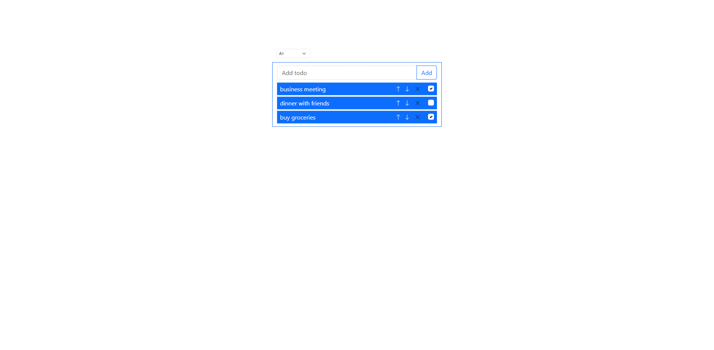
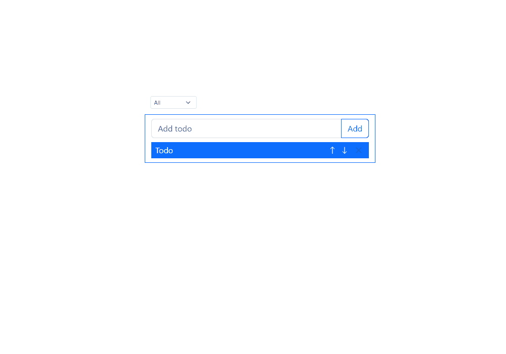

# Todo List App

A fully functional todo list with CRUD operations, priority management, and smart filtering. Built with vanilla JavaScript and local storage persistence.



## 🎥 See it in action



## ✨ Features

- ✅ Add, edit, and delete tasks
- ☑️ Mark tasks as done/undone
- ⬆️⬇️ Reorder tasks by priority (arrow buttons)
- 🔍 Filter: All / Done / Undone
- ⌨️ Keyboard edit shortcuts (Enter to save, Escape to cancel)
- 💾 Auto-saves to localStorage

## 🛠️ Technologies Used

- **HTML5**
- **CSS3**
- **JavaScript (ES6+)**
- **Bootstrap 5**
- **LocalStorage API**

## 🚀 Installation

```bash
git clone https://github.com/shebuildscode/todo-list.git
cd todo-list
```

Open `index.html` in your browser. **No dependencies required.**

## 💡 What I Learned

- **State management** without frameworks (dual-list system for master data + filtered views)
- **Event delegation** for dynamically created elements
- **LocalStorage** for persistent data
- **Edit mode handling** with keyboard support and edge case management
- **Array methods** for filtering and reordering (filter, splice, indexOf)

## 🐛 Key Challenge

Managing edit mode conflicts when multiple interactions happen simultaneously. Solved by implementing `closeExistingInput()` to ensure only one task can be edited at a time while preserving data integrity.

## 🎯 Future Improvements

- [ ] Drag-and-drop reordering
- [ ] Due dates and reminders
- [ ] Categories/tags
- [ ] Dark mode
- [ ] Search functionality

## 📧 Contact

GitHub: [@shebuildscode](https://github.com/shebuildscode)

E-mail: `shebuildscode@gmail.com`
<br><br><br>
**_Built as part of my web development learning journey. Check out my other projects!_**
